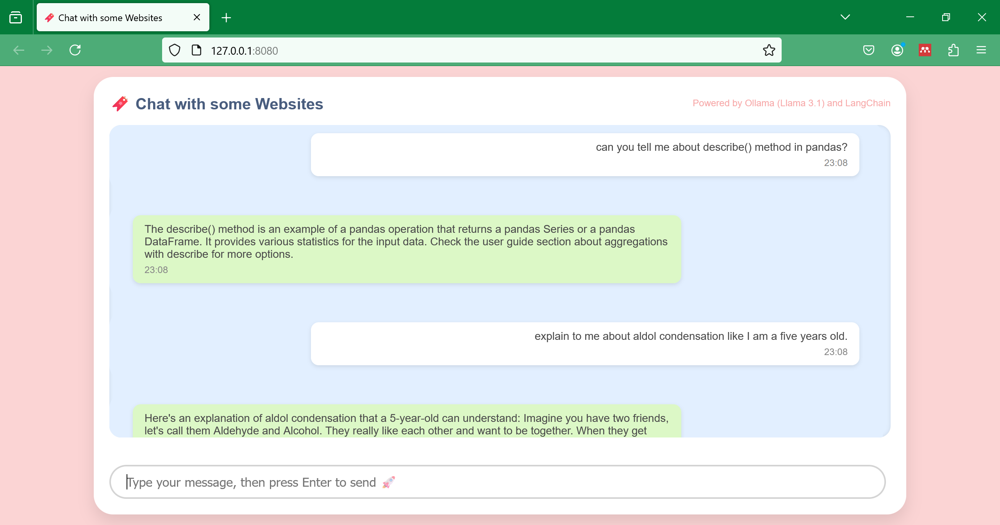

# Chat with Website using Ollama, Langchain, and Flask

- Initially I want to chat with file, but following along the tutorial from LangChain, I ended up making a chatbot with websites. I have tried the chatbot with Lilian Weng's blog, an OpenStax's Chemistry Textbook, and `pandas` documentation. As long as we don't erase the vectorstore manually, all the data from all the websites are stored, so we can chat with several websites.
- Surprisingly I learned how to do HTML and CSS this time.
- Currently doesn't have memory.

## Document Sources
1. [Lilian Weng's blog](https://lilianweng.github.io/posts/2023-06-23-agent/)
2. [OpenStax's Organic Chemistry Textbook](https://openstax.org/books/organic-chemistry/pages/23-1-carbonyl-condensations-the-aldol-reaction)
3. [`pandas` documentation](https://pandas.pydata.org/docs/getting_started/intro_tutorials/01_table_oriented.html#min-tut-01-tableoriented)

## Next Step
1. [Upload Files](https://flask.palletsprojects.com/en/2.3.x/patterns/fileuploads/)
2. [Chat History](https://python.langchain.com/v0.2/docs/how_to/qa_chat_history_how_to/)

## My Other Project
[Chat with File using Streamlit and Ollama](https://github.com/RiaAyuP/ollamarag) 

## References
1. [Sam Witteveen's Tutorial](https://github.com/samwit/langchain-tutorials/tree/main/2024/gemma2_local_rag)
2. [LangChain's Build a Local RAG](https://python.langchain.com/v0.2/docs/tutorials/local_rag/)
3. [LangChain's How to Q&A with RAG](https://python.langchain.com/v0.2/docs/how_to/#qa-with-rag)